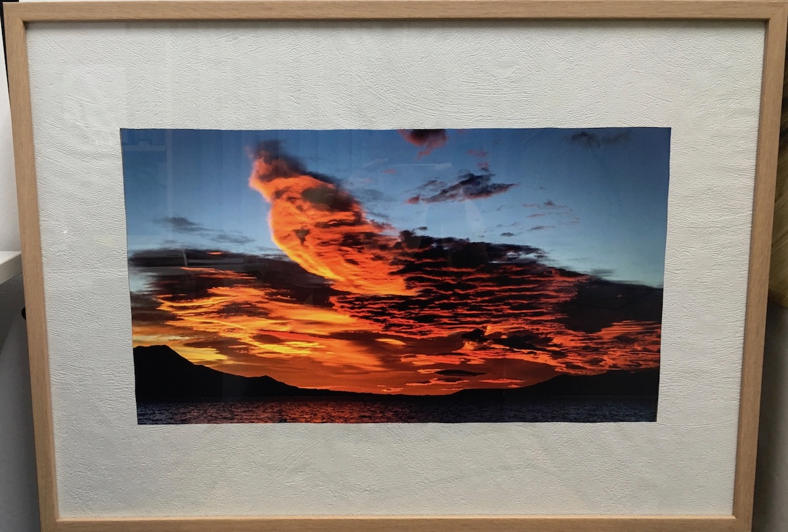
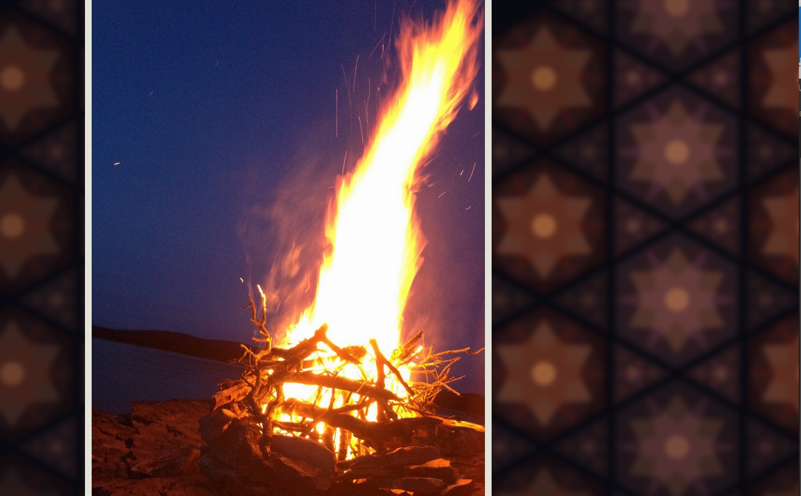
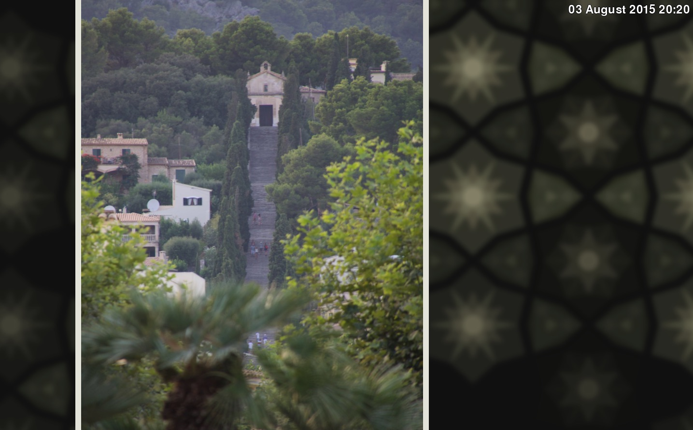
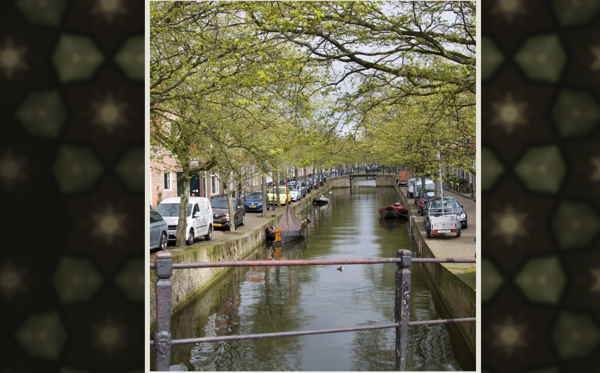
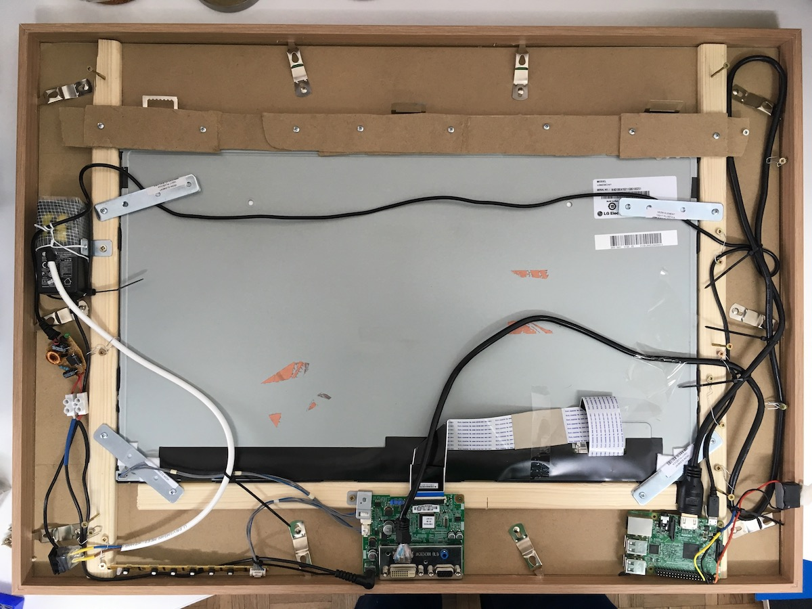

# RPy-Frame
RPy-Frame is a python software made for Raspberry PI that enables you to make your own awesome-looking budget digital photo frame.



### Screens




### Highlights & features
- Makes a slideshow of your photos, where each image is displayed for a configured amount of time
- Photos are played in random order, however, once a photo is played a few images that were taken at about the same time will be played after it. The aim was to see a part of the event.
- Photos are either scaled down so that they fit the screen or enlarged and scrolled during the playback. Since I find this behaviour tricky to get right, there are quite a few configuration rules available to tweak it.
- When photo does not take the full screen, a background will be generated with a pattern that will use the dominant colors of the current photo.
- There's also support for a phisical button, that can do the following at the moment:
	- short press: toggle date display
	- long press: advance to next photo
- Almost everything is configurable - have a look at src/settings.py

### Running the slideshow

You can run the presentation by executing the following:
```bash
python3.6 main.py /path/to/your/images/dir
```
You can always press Q or Esc during the presentation to stop it (to quit the app). If you don't specify the path to the images, then samples dir will be used.

If you want to explore configuration options of the app, then edit settings.py file. Currently there's no other documentation of all the settings but the settings.py, which is heavily commented.

You can run the program on your PC/Mac as well. Then you can use Q key to exit presentation or space to simulate the phisical button. On PC it's suggested to run it in dev/demo mode:
```bash
python3.6 main.py dev
```

# Installation
### Python 3.6
rpy-frame needs Python 3.6 to run. If you are using Raspberry PI, chances are you don’t have it yet and it might not be available through the apt package. Follow this guide to install it:
https://gist.github.com/dschep/24aa61672a2092246eaca2824400d37f

### Clone the repository

Clone rpy-frame repository:
```bash
git clone https://github.com/peterdolenc/rpy-frame.git
```

Try running it
```bash
cd rpy-frame/src
python3.6 main.py
```

### Install python packages
Probably you will need to install all the missing python packages first. For me the recipe was the following:

```bash
sudo apt-get update
sudo apt install libsdl2-dev libsdl2-image-dev libsdl2-mixer-dev libsdl2-ttf-dev libfreetype6-dev python3-setuptools python3-dev python3 libportmidi-dev
sudo apt-get install python3-numpy libsdl1.2-dev libsdl-image1.2-dev libsdl-mixer1.2-dev libsdl-ttf2.0-dev libsmpeg-dev libavformat-dev libswscale-dev libjpeg-dev
sudo pip3.6 install --upgrade pip
sudo pip3.6 install pygame
sudo pip3.6 install pillow
sudo pip3.6 install scipy
sudo pip3.6 install matplotlib
sudo pip3.6 install six
sudo pip3.6 install colorthief
sudo pip3.6 install RPi.GPIO
```

# Optional setup
There are two extra optional setup steps that you might want to configure.

### Auto start presentation on boot
Create an sh file in your home directory called "slideshow.sh". This is the script that will get executed on startup. Set the path to your photos as desired. I also like to keep a log of last run somewhere.

```bash
/home/pi/rpy-frame/src/main.py /home/pi/photos/ >> lastrun.log &
```

There are multiple ways to configure auto start of an app when UI starts. I found this one to work best. Edit "/.config/lxsession/LXDE-pi/autostart" and add:

```bash
@/home/pi/slideshow.sh
```

Also don't forget to setup your raspi to boot to desktop and configure that "start bar" to auto.hide. This will give you the full "kiosk mode" experience.


### Turn off the display during the night to save energy
I used crontab for that. The commands handle raspi's video out and basically get the screen to go to standby. Here are the two crontab commands that will add a schedule to turn off the display every day at 22.30 and turn it back up at 05:15 in the morning. Feel free to adjust to your needs.

```bash
crontab 30 22 * * * vcgencmd display_power 0 >/dev/null 2>&1
crontab 15 5 * * * vcgencmd display_power 1 >/dev/null 2>&1
```

### Setting up the phisical button
Generally any pull-up button will work as long as it will read 1 when pressed and 0 when idle. By default the app will expect the button to be connected to GPIO header pin nr. 23. But it can be configured in settings.py.

You can use this little snippet to debug and test your button prior to using it with your app:

```bash
import RPi.GPIO as GPIO

# use P1 header pin numbering convention
GPIO.setmode(GPIO.BOARD)
GPIO.setup(23, GPIO.IN)
print(GPIO.input(23))
```

# Building the picture frame hardware
It's not too difficult or expensive. In any case you will need:
- Rasperry Pi (any as long as it has HDMI)
- power adaptor downto 5V for raspi; can be combined with whateve the monitor uses, but it of course depends
- a nice wooden picture frame; it has to be larger than the screen so that you have some space on the edges to fit the components
- optional: phisical button

Missing component is the screen. There are generally two approaches.
1. You buy used PC screen: this is the best and by far the simplest approach. The screen will already come with the panel, the driver board, backlighting and power adaptor. Be careful to find one that uses slim components (most of them do). This is suitable, if you are building a large photo frame. I really like my 24" inch photo frame. And one more tip: you must go for LED IPS screen if you value your photos. You will thank me later.
2. You have a spare screen from an old laptop you would like to use. This is going to be more difficult as you will have to source the backlighting driver, power adaptor and the driver-board yourself. Search ebay for a good board where your EXACT model of the screen panel is listed as supported. Universal boards only gave me TONS of headaches.



# Credits:

Code for the patterns taken and adapted from:
https://github.com/eleanorlutz/AnimatedPythonPatterns/blob/master/PatternMaker.ipynb

Original idea and some base concepts for pygame photo frame:
https://github.com/gitajt/PGslideshow


